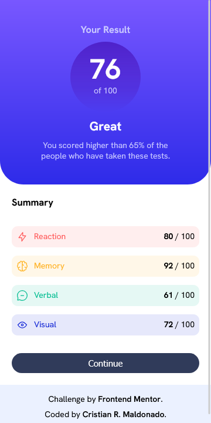

# Frontend Mentor - Results summary component solution

This is a solution to the [Results summary component challenge on Frontend Mentor](https://www.frontendmentor.io/challenges/results-summary-component-CE_K6s0maV). Frontend Mentor challenges help you improve your coding skills by building realistic projects. 

## Table of contents

- [Overview](#overview)
  - [The challenge](#the-challenge)
  - [Screenshot](#screenshot)
  - [Links](#links)
- [My process](#my-process)
  - [Built with](#built-with)
  - [What I learned](#what-i-learned)
  - [Continued development](#continued-development)
- [Author](#author)
- [Acknowledgments](#acknowledgments)

## Overview

### The challenge

Users should be able to:

- View the optimal layout for the interface depending on their device's screen size
- See hover and focus states for all interactive elements on the page
- **Bonus**: Use the local JSON data to dynamically populate the content

### Screenshots

### Links

- [Solution URL:](https://github.com/cristianmdn/results-summary-component)
- [Live Site URL:](https://crm-results-summary-component.netlify.app/)

## My process

### Built with

- Semantic HTML5 markup
- Flexbox
- Desktop-first workflow

### What I learned

I was scared about the gradient colors. Well not scared but it's like I was avoiding it for some reason. But after a quick search through the docs I realized that it is actually very easy to use and apply to anything you want.

### Continued development

In this project I focused mostly on the layout and making the site responsive. I am going to take a break now to continue learnig with freeCodeCamp and youtube videos. I need to have a better understanding about responsive design. I'll come back later to Frontend Mentor to continue with the challenges. This have been very fun and I've learned a lot already.

## Author

- [Github Profile](https://github.com/cristianmdn)
- [Frontend Mentor Profile](https://www.frontendmentor.io/profile/yourusername)

## Acknowledgments

I want to give a big thanks to Kevin Powell and Kyle from Web Dev Simplified. Those guys are incredible teachers and they know their stuff really well. They have amazing FREE content on their youtube channels.